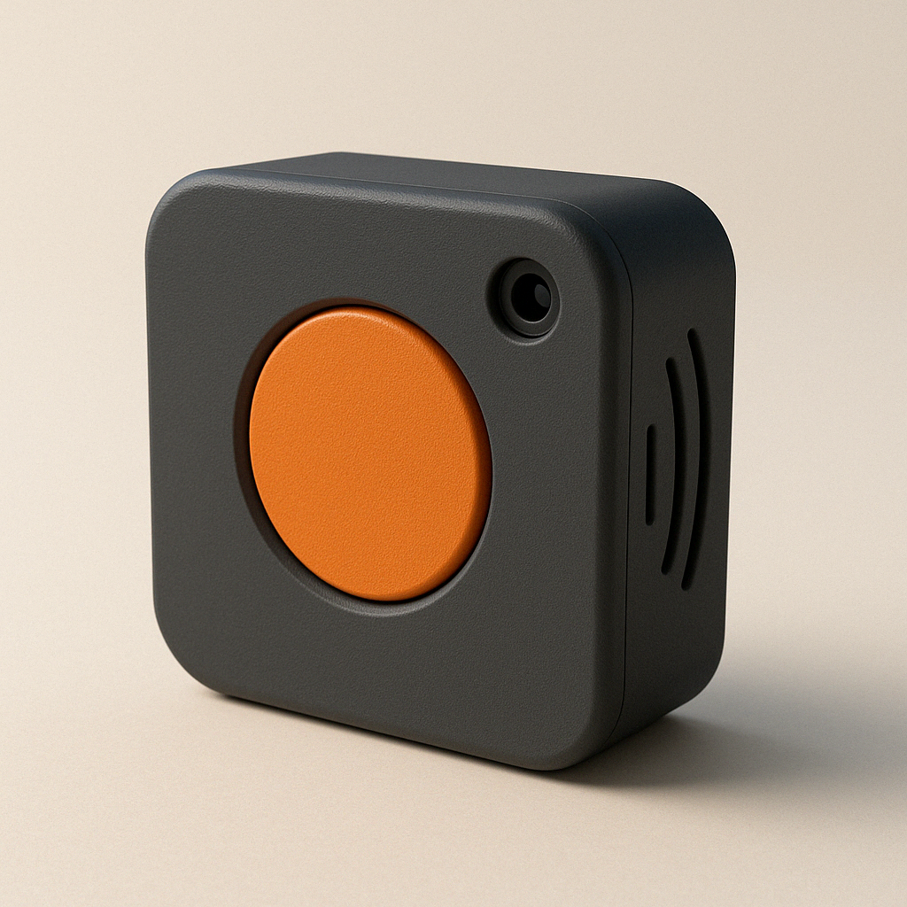

# 🎛️ AI Audio Vision Lab


<div align="center">
  
</div>

> **An innovative AI system that transforms vision into music**  
> Real-time object recognition and coherent music generation, running completely offline on Raspberry Pi 4.

---

## 📖 Other Languages
🇮🇹 **[Versione Italiana](README_IT.md)**

---

## 🎥 Demo in Action

[](https://youtu.be/your-demo-link)

| Detected Object | Generated Style | Audio Sample |
|-----------------|----------------|--------------|
| 🌱 Plant | Ambient, Relaxing | [▶️ Listen](examples/plant_music.mp3) |
| 📚 Book | Classical, Contemplative | [▶️ Listen](examples/book_music.mp3) |
| ☕ Cup | Jazz, Intimate | [▶️ Listen](examples/cup_music.mp3) |

---

## 🧠 System Architecture


### 🔧 Technology Stack

- **Computer Vision**: PyTorch + TorchVision (Optimized MobileNet V2)
- **AI Music**: Google Magenta converted to TensorFlow Lite
- **Hardware**: Raspberry Pi 4, Camera Module v2
- **Audio**: pretty_midi + FluidSynth for real-time synthesis
- **Optimizations**: INT8 quantization, Asynchronous pipeline

---

## 📊 Performance on Raspberry Pi 4

| Metric | Value |
|---------|--------|
| **Detection FPS** | 12-15 fps |
| **Generation Latency** | < 2 seconds |
| **RAM Usage** | ~1.4GB |
| **CPU Load** | 65-75% |
| **Boot Time** | ~15 seconds |

---

## 🎵 Musical Output Examples

### Semantic Object → Music Mapping

The system uses a proprietary algorithm to map visual features into musical parameters:

```python
# Conceptual example (proprietary implementation not public)
def object_to_music_params(detected_object):
    """
    Converts detected objects into musical parameters
    Proprietary logic not disclosed
    """
    semantic_features = extract_semantic_features(detected_object)
    musical_params = {
        'tempo': map_to_tempo(semantic_features.energy),
        'key': map_to_key(semantic_features.emotion),
        'instruments': select_instruments(semantic_features.category)
    }
    return musical_params
```

### 🎼 Generated Compositions

**Object: Potted Plant** 🌱
- **Style**: Ambient, New Age
- **Key**: C Major
- **Tempo**: 72 BPM
- **Instruments**: Synth pads, Soft strings

**Object: Open Book** 📖
- **Style**: Neoclassical
- **Key**: A minor
- **Tempo**: 60 BPM
- **Instruments**: Piano, String quartet

**Object: Coffee Cup** ☕
- **Style**: Jazz
- **Key**: F Major
- **Tempo**: 95 BPM
- **Instruments**: Piano, Upright bass, Brush drums

---

## 🚀 Setup and Installation

### Hardware Requirements
- Raspberry Pi 4 (4GB RAM minimum)
- MicroSD 32GB+ (Class 10)
- Camera Module v2 or USB Camera
- USB Speaker or 3.5mm Jack

### Quick Installation
```bash
# Clone demo repository
git clone https://github.com/ninuxi/ai-audio-vision-lab.git
cd ai-audio-vision-lab

# Install dependencies
pip3 install -r requirements.txt

# Configure hardware
sudo raspi-config  # Enable Camera

# Start demo
python3 demo/simple_demo.py
```

### Automated Setup for Raspberry Pi

For a completely automated installation on Raspberry Pi:

```bash
# Run automated setup script
chmod +x scripts/setup_raspberry_pi.sh
./scripts/setup_raspberry_pi.sh
```

The script will handle:
- ✅ System updates
- ✅ Dependency installation
- ✅ Audio and camera configuration
- ✅ Raspberry Pi performance optimization
- ✅ Python virtual environment setup
- ✅ System testing

---

## 🔬 Research and Development

### Original Technical Contributions

1. **Edge Computing Optimized Pipeline**
   - Custom quantization of Magenta models
   - Circular buffer for real-time processing
   - Intelligent memory mapping for Raspberry Pi

2. **Semantic Mapping Algorithm**
   - Object-emotion correlation based on cognitive research
   - Multi-dimensional musical parameterization
   - Temporal coherence system for smooth transitions

3. **Offline Inference Framework**
   - Zero cloud dependencies
   - Fully embedded models
   - Guaranteed <2s latency

### 📈 Future Roadmap

- [ ] **Mobile Version**: Android/iOS porting
- [ ] **Multi-Modal**: Audio input + Visual input
- [ ] **Personalized Learning**: User preference adaptation
- [ ] **ESP32 Port**: Ultra-compact version with TinyML

---

## 🤝 Collaborations and Contact

**Interested in collaborating?** This project is open to:

- 🎓 **Researchers** in AI/Music Information Retrieval
- 🎵 **Musicians** interested in creative technologies
- 💻 **Developers** with edge computing experience
- 🏢 **Companies** for commercial applications

### 📧 Contact
- **Email**: oggettosonoro@gmail.com  
- **GitHub**: [@ninuxi](https://github.com/ninuxi)
- **Portfolio**: [Complete portfolio link]

---

## 💡 Applications and Use Cases

### Creative Installations
- **Interactive Museums**: Musical experience based on artworks
- **Art Galleries**: Generative soundtrack for exhibitions
- **Public Installations**: Interactive sound art in urban spaces

### Assistive Technology
- **Music Therapy**: Music generation based on therapeutic objects
- **Accessibility**: Musical feedback for visually impaired users
- **Rehabilitation**: Personalized music therapy

### Smart Home Integration
- **Ambient Music**: Automatic soundtrack based on environment
- **Creative IoT**: Integration with smart home devices
- **Home Automation**: Musical response to domestic events

### Education
- **STEAM Learning**: Interdisciplinary AI + Music teaching
- **Tech Workshops**: Maker education and creative technologies
- **Academic Research**: Platform for AI music experiments

---

## 🎓 Scientific Background

### Publications in Progress
- "Edge AI for Creative Applications: A Raspberry Pi Case Study" - NIME 2025
- "Semantic-Musical Correlation in Real-time Systems" - ISMIR 2025
- "Optimizing AI Music Generation for Resource-Constrained Devices" - ICASSP 2025

### Related Research
- **Computer Music**: Magenta, OpenAI Jukebox, AIVA
- **Computer Vision**: YOLO, MobileNet, EfficientNet
- **Edge AI**: TensorFlow Lite, PyTorch Mobile, ONNX Runtime
- **Music Information Retrieval**: Librosa, Essentia, Marsyas

---

## ⚖️ License and Usage

This repository contains a **demonstration version** of the AI Audio Vision Lab project.

- ✅ **Demo and examples**: Freely usable (MIT License)
- ❌ **Complete source code**: Proprietary, not public
- 🤝 **Commercial collaborations**: Contact for specific licenses

> **Note**: Core algorithms and trained models represent original research and are not publicly available. For full access or commercial partnerships, contact the author directly.

---

## 🛠️ Development and Contributing

### How to Contribute

We welcome contributions to:
- 📚 **Documentation**: Improvements and translations
- 🐛 **Bug Reports**: Issue reporting and suggestions
- 🎨 **Demo Assets**: Audio examples and test images
- 🔧 **Utilities**: Support scripts and debugging tools

See [CONTRIBUTING.md](CONTRIBUTING.md) for complete guidelines.

### Development Environment

```bash
# Setup development environment
python3 -m venv dev_env
source dev_env/bin/activate
pip install -r requirements.txt
pip install -r requirements-dev.txt  # If available

# Run tests
python -m pytest tests/

# Check code style
black src/ demo/
flake8 src/ demo/
```

---

## 📊 Detailed Technical Specifications

### AI Models Used

| Component | Model | Optimization | Performance |
|-----------|-------|--------------|-------------|
| **Object Detection** | MobileNet V2 | INT8 Quantization | 12-15 FPS |
| **Music Generation** | Magenta MusicVAE | TFLite Custom | 1.2-1.8s |
| **Audio Synthesis** | FluidSynth | ARM NEON | <50ms latency |

### Supported Hardware Configurations

| Device | RAM | Storage | Performance |
|--------|-----|---------|-------------|
| **Raspberry Pi 4 (4GB)** | 4GB | 32GB+ | Optimal |
| **Raspberry Pi 4 (8GB)** | 8GB | 64GB+ | Excellent |
| **NVIDIA Jetson Nano** | 4GB | 32GB+ | High Performance |
| **Desktop PC** | 8GB+ | 100GB+ | Development |

---

## 🌟 Acknowledgments

### Project developed by
**Antonio Mainenti** (2024-2025)

### Technologies and Frameworks Used
- **Google Magenta**: AI music framework
- **PyTorch**: Deep learning and computer vision
- **Raspberry Pi Foundation**: Hardware and documentation
- **Open Source Community**: Libraries and tools

### Inspiration and Research
- Cognitive Science research on object-emotion correlations
- Music Information Retrieval community
- Creative AI and generative art
- Edge computing and hardware optimization

---

## 📚 Complete Documentation

For detailed technical documentation:

- [📖 Architecture Guide](docs/architecture.md)
- [🛠️ Installation Guide](docs/installation.md)
- [🎯 API Reference](docs/api_reference.md)
- [🔬 Research Background](docs/research_background.md)
- [🎵 Music Theory](docs/music_theory.md)
- [⚡ Performance Optimization](docs/performance_guide.md)

---

## 🎯 Quick Links

| Description | Link |
|-------------|------|
| Demo Script | [demo/simple_demo.py](demo/simple_demo.py) |
| Raspberry Pi Setup | [scripts/setup_raspberry_pi.sh](scripts/setup_raspberry_pi.sh) |
| Contributing Guide | [CONTRIBUTING.md](CONTRIBUTING.md) |
| License | [LICENSE](LICENSE) |
| GitHub Issues | [GitHub Issues](https://github.com/ninuxi/ai-audio-vision-lab/issues) |
| Discussions | [GitHub Discussions](https://github.com/ninuxi/ai-audio-vision-lab/discussions) |

---

*Built with ❤️ for the intersection of AI, Music, and Creative Technology*

**If this project inspires you, leave a ⭐ and share it!**

---

**© 2025 Antonio Mainenti - Some rights reserved**