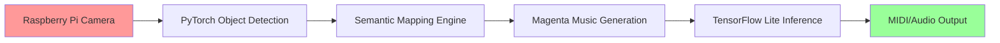

# 🎛️ AI Audio Vision Lab


> **An innovative AI system that transforms vision into music**  
> Real-time object recognition and coherent music generation, running completely offline on Raspberry Pi 4.

---

## 🎥 Demo in Action

[](https://youtu.be/your-demo-link)

| Detected Object | Generated Style | Audio Sample |
|-----------------|----------------|--------------|
| 🌱 Plant | Ambient, Relaxing | [▶️ Listen](examples/plant_music.mp3) |
| 📚 Book | Classical, Contemplative | [▶️ Listen](examples/book_music.mp3) |
| ☕ Cup | Jazz, Intimate | [▶️ Listen](examples/cup_music.mp3) |

---

## 🧠 System Architecture



### 🔧 Technology Stack

- **Computer Vision**: PyTorch + TorchVision (Optimized MobileNet V2)
- **AI Music**: Google Magenta converted to TensorFlow Lite
- **Hardware**: Raspberry Pi 4, Camera Module v2
- **Audio**: pretty_midi + FluidSynth for real-time synthesis
- **Optimizations**: INT8 quantization, Asynchronous pipeline

---

## 📊 Performance on Raspberry Pi 4

| Metric | Value |
|---------|--------|
| **Detection FPS** | 12-15 fps |
| **Generation Latency** | < 2 seconds |
| **RAM Usage** | ~1.4GB |
| **CPU Load** | 65-75% |
| **Boot Time** | ~15 seconds |

---

## 🎵 Musical Output Examples

### Semantic Object → Music Mapping

The system uses a proprietary algorithm to map visual features into musical parameters:

```python
# Conceptual example (proprietary implementation not public)
def object_to_music_params(detected_object):
    """
    Converts detected objects into musical parameters
    Proprietary logic not disclosed
    """
    semantic_features = extract_semantic_features(detected_object)
    musical_params = {
        'tempo': map_to_tempo(semantic_features.energy),
        'key': map_to_key(semantic_features.emotion),
        'instruments': select_instruments(semantic_features.category)
    }
    return musical_params
```

### 🎼 Generated Compositions

**Object: Potted Plant** 🌱
- **Style**: Ambient, New Age
- **Key**: C Major
- **Tempo**: 72 BPM
- **Instruments**: Synth pads, Soft strings

**Object: Open Book** 📖
- **Style**: Neoclassical
- **Key**: A minor
- **Tempo**: 60 BPM
- **Instruments**: Piano, String quartet

---

## 🚀 Setup and Installation

### Hardware Requirements
- Raspberry Pi 4 (4GB RAM minimum)
- MicroSD 32GB+ (Class 10)
- Camera Module v2 or USB Camera
- USB Speaker or 3.5mm Jack

### Quick Installation
```bash
# Clone demo repository
git clone https://github.com/ninuxi/ai-audio-vision-lab.git
cd ai-audio-vision-lab

# Install dependencies
pip3 install -r requirements.txt

# Configure hardware
sudo raspi-config  # Enable Camera

# Start demo
python3 demo/vision_music_demo.py
```

---

## 🔬 Research and Development

### Original Technical Contributions

1. **Edge Computing Optimized Pipeline**
   - Custom quantization of Magenta models
   - Circular buffer for real-time processing
   - Intelligent memory mapping for Raspberry Pi

2. **Semantic Mapping Algorithm**
   - Object-emotion correlation based on cognitive research
   - Multi-dimensional musical parameterization
   - Temporal coherence system for smooth transitions

3. **Offline Inference Framework**
   - Zero cloud dependencies
   - Fully embedded models
   - Guaranteed <2s latency

### 📈 Future Roadmap

- [ ] **Mobile Version**: Android/iOS porting
- [ ] **Multi-Modal**: Audio input + Visual input
- [ ] **Personalized Learning**: User preference adaptation
- [ ] **ESP32 Port**: Ultra-compact version with TinyML

---

## 🤝 Collaborations and Contact

**Interested in collaborating?** This project is open to:

- 🎓 **Researchers** in AI/Music Information Retrieval
- 🎵 **Musicians** interested in creative technologies
- 💻 **Developers** with edge computing experience
- 🏢 **Companies** for commercial applications

### 📧 Contact
- **Email**: oggettosonoro@gmail.com  
- **GitHub**: [@ninuxi](https://github.com/ninuxi)
- **Portfolio**: [Complete portfolio link]

---

## ⚖️ License and Usage

This repository contains a **demonstration version** of the AI Audio Vision Lab project.  

- ✅ **Demo and examples**: Freely usable (MIT License)
- ❌ **Complete source code**: Proprietary, not public
- 🤝 **Commercial collaborations**: Contact for specific licenses

> **Note**: Core algorithms and trained models represent original research and are not publicly available. For full access or commercial partnerships, contact the author directly.

---

## 🌟 Acknowledgments

Project developed by **Antonio Mainenti** (2024-2025)

*If this project inspires you, leave a ⭐ and share it!*

---

**© 2025 Antonio Mainenti - Some rights reserved**

---

## 🇮🇹 Versione Italiana

Un sistema AI su Raspberry Pi che riconosce oggetti in tempo reale e genera musica coerente tramite modelli di intelligenza artificiale, funzionando completamente offline.

### Caratteristiche principali

- Riconoscimento oggetti in tempo reale con PyTorch  
- Conversione dei modelli Magenta in TensorFlow Lite per esecuzione locale  
- Generazione musicale basata su oggetti rilevati  
- Intero sistema offline su Raspberry Pi 4  

### Installazione & Uso

1. Clona il repository  
   ```bash
   git clone https://github.com/ninuxi/ai-audio-vision-lab.git
   cd ai-audio-vision-lab
   ```

2. Installa le dipendenze Python
   ```bash
   pip install -r requirements.txt
   ```

3. Inserisci la microSD nel Raspberry Pi 4

4. Esegui lo script
   ```bash
   python3 main.py
   ```

5. Inquadra un oggetto: verrà generata una melodia coerente.

### Contatti

- **Email**: oggettosonoro@gmail.com
- **GitHub**: [@ninuxi](https://github.com/ninuxi)

Per la documentazione completa in italiano, vedi [docs/README_IT.md](docs/README_IT.md).