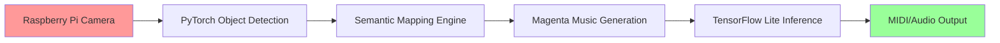

# 🎛️ AI Audio Vision Lab


<div align="center">
  
</div>

> **🇬🇧 An innovative AI system that transforms vision into music**  
> Real-time object recognition and coherent music generation, running completely offline on Raspberry Pi 4.

> **🇮🇹 Un sistema AI innovativo che trasforma la visione in musica**  
> Riconoscimento oggetti in tempo reale e generazione musicale coerente, completamente offline su Raspberry Pi 4.

---

## 🎥 Demo in Action | Demo dal Vivo

[](https://youtu.be/your-demo-link)

| 🇬🇧 Detected Object | 🇮🇹 Oggetto Rilevato | Generated Style | Audio Sample |
|---------------------|----------------------|-----------------|--------------|
| 🌱 Plant | 🌱 Pianta | Ambient, Relaxing | [▶️ Listen](examples/plant_music.mp3) |
| 📚 Book | 📚 Libro | Classical, Contemplative | [▶️ Listen](examples/book_music.mp3) |
| ☕ Cup | ☕ Tazza | Jazz, Intimate | [▶️ Listen](examples/cup_music.mp3) |

---

## 🧠 System Architecture | Architettura del Sistema



### 🔧 Technology Stack | Stack Tecnologico

**🇬🇧 English:**
- **Computer Vision**: PyTorch + TorchVision (Optimized MobileNet V2)
- **AI Music**: Google Magenta converted to TensorFlow Lite
- **Hardware**: Raspberry Pi 4, Camera Module v2
- **Audio**: pretty_midi + FluidSynth for real-time synthesis
- **Optimizations**: INT8 quantization, Asynchronous pipeline

**🇮🇹 Italiano:**
- **Computer Vision**: PyTorch + TorchVision (MobileNet V2 ottimizzato)
- **AI Music**: Google Magenta convertito in TensorFlow Lite
- **Hardware**: Raspberry Pi 4, Camera Module v2
- **Audio**: pretty_midi + FluidSynth per sintesi real-time
- **Ottimizzazioni**: Quantizzazione INT8, Pipeline asincrona

---

## 📊 Performance on Raspberry Pi 4 | Performance su Raspberry Pi 4

| Metric | 🇬🇧 Value | 🇮🇹 Valore |
|---------|------------|-------------|
| **Detection FPS** | 12-15 fps | 12-15 fps |
| **Generation Latency** | < 2 seconds | < 2 secondi |
| **RAM Usage** | ~1.4GB | ~1.4GB |
| **CPU Load** | 65-75% | 65-75% |
| **Boot Time** | ~15 seconds | ~15 secondi |

---

## 🎵 Musical Output Examples | Esempi di Output Musicale

### 🇬🇧 Semantic Object → Music Mapping

The system uses a proprietary algorithm to map visual features into musical parameters:

```python
# Conceptual example (proprietary implementation not public)
def object_to_music_params(detected_object):
    """
    Converts detected objects into musical parameters
    Proprietary logic not disclosed
    """
    semantic_features = extract_semantic_features(detected_object)
    musical_params = {
        'tempo': map_to_tempo(semantic_features.energy),
        'key': map_to_key(semantic_features.emotion),
        'instruments': select_instruments(semantic_features.category)
    }
    return musical_params
```

### 🇮🇹 Mappatura Semantica Oggetto → Musica

Il sistema utilizza un algoritmo proprietario per mappare caratteristiche visive in parametri musicali:

```python
# Esempio concettuale (implementazione proprietaria non pubblica)
def object_to_music_params(detected_object):
    """
    Converte oggetti rilevati in parametri musicali
    Logica proprietaria non divulgata
    """
    semantic_features = extract_semantic_features(detected_object)
    musical_params = {
        'tempo': map_to_tempo(semantic_features.energy),
        'key': map_to_key(semantic_features.emotion),
        'instruments': select_instruments(semantic_features.category)
    }
    return musical_params
```

### 🎼 Generated Compositions | Composizioni Generate

**🇬🇧 Object: Potted Plant** 🌱 | **🇮🇹 Oggetto: Pianta in Vaso** 🌱
- **Style | Stile**: Ambient, New Age
- **Key | Tonalità**: C Major | Do Maggiore
- **Tempo**: 72 BPM
- **Instruments | Strumenti**: Synth pads, Soft strings | Pad sintetici, Archi soft

**🇬🇧 Object: Open Book** 📖 | **🇮🇹 Oggetto: Libro Aperto** 📖
- **Style | Stile**: Neoclassical | Neoclassico
- **Key | Tonalità**: A minor | La minore
- **Tempo**: 60 BPM
- **Instruments | Strumenti**: Piano, String quartet | Pianoforte, Quartetto d'archi

---

## 🚀 Setup and Installation | Installazione e Configurazione

### 🇬🇧 Hardware Requirements | 🇮🇹 Requisiti Hardware

**🇬🇧 English:**
- Raspberry Pi 4 (4GB RAM minimum)
- MicroSD 32GB+ (Class 10)
- Camera Module v2 or USB Camera
- USB Speaker or 3.5mm Jack

**🇮🇹 Italiano:**
- Raspberry Pi 4 (4GB RAM minimo)
- MicroSD 32GB+ (Classe 10)
- Camera Module v2 o Camera USB
- Speaker USB o Jack 3.5mm

### Quick Installation | Installazione Rapida

```bash
# 🇬🇧 Clone demo repository | 🇮🇹 Clona il repository demo
git clone https://github.com/ninuxi/ai-audio-vision-lab.git
cd ai-audio-vision-lab

# 🇬🇧 Install dependencies | 🇮🇹 Installa le dipendenze
pip3 install -r requirements.txt

# 🇬🇧 Configure hardware | 🇮🇹 Configura hardware
sudo raspi-config  # Enable Camera | Abilita Camera

# 🇬🇧 Start demo | 🇮🇹 Avvia demo
python3 demo/simple_demo.py
```

### 🇬🇧 Automated Setup for Raspberry Pi | 🇮🇹 Setup Automatico per Raspberry Pi

```bash
# 🇬🇧 Run automated setup script | 🇮🇹 Esegui script di setup automatico
chmod +x scripts/setup_raspberry_pi.sh
./scripts/setup_raspberry_pi.sh
```

---

## 🔬 Research and Development | Ricerca e Sviluppo

### 🇬🇧 Original Technical Contributions | 🇮🇹 Contributi Tecnici Originali

**🇬🇧 English:**

1. **Edge Computing Optimized Pipeline**
   - Custom quantization of Magenta models
   - Circular buffer for real-time processing
   - Intelligent memory mapping for Raspberry Pi

2. **Semantic Mapping Algorithm**
   - Object-emotion correlation based on cognitive research
   - Multi-dimensional musical parameterization
   - Temporal coherence system for smooth transitions

3. **Offline Inference Framework**
   - Zero cloud dependencies
   - Fully embedded models
   - Guaranteed <2s latency

**🇮🇹 Italiano:**

1. **Pipeline Ottimizzata per Edge Computing**
   - Quantizzazione personalizzata dei modelli Magenta
   - Buffer circolare per elaborazione real-time
   - Memory mapping intelligente per Raspberry Pi

2. **Algoritmo di Mappatura Semantica**
   - Correlazione oggetto-emozione basata su ricerca cognitiva
   - Parametrizzazione musicale multi-dimensionale
   - Sistema di coerenza temporale per transizioni fluide

3. **Framework di Inferenza Offline**
   - Zero dipendenze cloud
   - Modelli completamente embedded
   - Latenza <2s garantita

### 📈 Future Roadmap | Roadmap Futura

- [ ] **🇬🇧 Mobile Version | 🇮🇹 Versione Mobile**: Android/iOS porting
- [ ] **🇬🇧 Multi-Modal | 🇮🇹 Multi-Modalità**: Audio input + Visual input
- [ ] **🇬🇧 Personalized Learning | 🇮🇹 Apprendimento Personalizzato**: User preference adaptation
- [ ] **🇬🇧 ESP32 Port | 🇮🇹 Porting ESP32**: Ultra-compact version with TinyML

---

## 🤝 Collaborations and Contact | Collaborazioni e Contatti

**🇬🇧 Interested in collaborating? | 🇮🇹 Interessato a collaborare?**

**🇬🇧 This project is open to:**
- 🎓 **Researchers** in AI/Music Information Retrieval
- 🎵 **Musicians** interested in creative technologies
- 💻 **Developers** with edge computing experience
- 🏢 **Companies** for commercial applications

**🇮🇹 Questo progetto è aperto a:**
- 🎓 **Ricercatori** in AI/Music Information Retrieval
- 🎵 **Musicisti** interessati a tecnologie creative
- 💻 **Sviluppatori** con esperienza in edge computing
- 🏢 **Aziende** per applicazioni commerciali

### 📧 Contact | Contatti
- **Email**: oggettosonoro@gmail.com  
- **GitHub**: [@ninuxi](https://github.com/ninuxi)
- **Portfolio**: [Complete portfolio link]

---

## ⚖️ License and Usage | Licenza e Utilizzo

**🇬🇧 This repository contains a demonstration version of the AI Audio Vision Lab project.**

- ✅ **Demo and examples**: Freely usable (MIT License)
- ❌ **Complete source code**: Proprietary, not public
- 🤝 **Commercial collaborations**: Contact for specific licenses

**🇮🇹 Questo repository contiene una versione dimostrativa del progetto AI Audio Vision Lab.**

- ✅ **Demo ed esempi**: Liberamente utilizzabili (Licenza MIT)
- ❌ **Codice sorgente completo**: Proprietario, non pubblico
- 🤝 **Collaborazioni commerciali**: Contatta per licenze specifiche

> **🇬🇧 Note**: Core algorithms and trained models represent original research and are not publicly available. For full access or commercial partnerships, contact the author directly.

> **🇮🇹 Nota**: Gli algoritmi core e i modelli addestrati rappresentano ricerca originale e non sono pubblicamente disponibili. Per accesso completo o partnership commerciali, contatta direttamente l'autore.

---

## 🌟 Acknowledgments | Riconoscimenti

**🇬🇧 Project developed by** **Antonio Mainenti** (2024-2025)  
**🇮🇹 Progetto sviluppato da** **Antonio Mainenti** (2024-2025)

*🇬🇧 If this project inspires you, leave a ⭐ and share it!*  
*🇮🇹 Se questo progetto ti ispira, lascia una ⭐ e condividilo!*

---

**© 2025 Antonio Mainenti - Some rights reserved | Alcuni diritti riservati**

---

## 📚 Complete Documentation | Documentazione Completa

**🇬🇧 For complete documentation:**
- [📖 Architecture Guide](docs/architecture.md)
- [🛠️ Installation Guide](docs/installation.md)
- [🎯 API Reference](docs/api_reference.md)
- [🔬 Research Background](docs/research_background.md)

**🇮🇹 Per la documentazione completa:**
- [📖 Guida Architettura](docs/architecture.md)
- [🛠️ Guida Installazione](docs/installation.md)
- [🎯 Riferimento API](docs/api_reference.md)
- [🔬 Background di Ricerca](docs/research_background.md)

---

## 🎯 Quick Links | Link Rapidi

| 🇬🇧 English | 🇮🇹 Italiano | Link |
|-------------|--------------|------|
| Demo Script | Script Demo | [demo/simple_demo.py](demo/simple_demo.py) |
| Setup Guide | Guida Setup | [scripts/setup_raspberry_pi.sh](scripts/setup_raspberry_pi.sh) |
| Contributing | Contribuire | [CONTRIBUTING.md](CONTRIBUTING.md) |
| License | Licenza | [LICENSE](LICENSE) |
| Issues | Problemi | [GitHub Issues](https://github.com/ninuxi/ai-audio-vision-lab/issues) |
| Discussions | Discussioni | [GitHub Discussions](https://github.com/ninuxi/ai-audio-vision-lab/discussions) |

---

*🇬🇧 Built with ❤️ for the intersection of AI, Music, and Creative Technology*  
*🇮🇹 Costruito con ❤️ per l'intersezione tra AI, Musica e Tecnologie Creative*