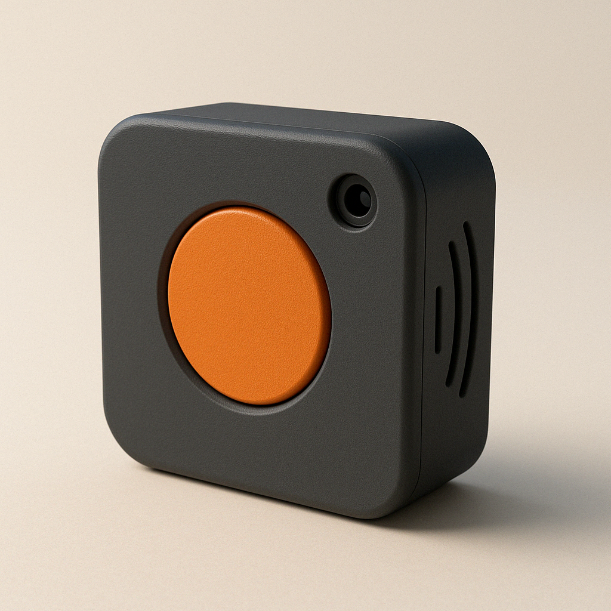

# 🎛️ AI Audio Vision Lab


<div align="center">
  
</div>

> **Un sistema AI innovativo che trasforma la visione in musica**  
> Riconoscimento oggetti in tempo reale e generazione musicale coerente, funzionando completamente offline su Raspberry Pi 4.

---

## 📖 Altre Lingue
🇬🇧 **[English Version](README.md)**

---

## 🎥 Demo dal Vivo

[](https://youtu.be/your-demo-link)

| Oggetto Rilevato | Stile Generato | Sample Audio |
|------------------|----------------|--------------|
| 🌱 Pianta | Ambient, Rilassante | [▶️ Ascolta](examples/plant_music.mp3) |
| 📚 Libro | Classico, Contemplativo | [▶️ Ascolta](examples/book_music.mp3) |
| ☕ Tazza | Jazz, Intimo | [▶️ Ascolta](examples/cup_music.mp3) |

---

## 🧠 Architettura del Sistema


### 🔧 Stack Tecnologico

- **Computer Vision**: PyTorch + TorchVision (MobileNet V2 ottimizzato)
- **AI Music**: Google Magenta convertito in TensorFlow Lite
- **Hardware**: Raspberry Pi 4, Camera Module v2
- **Audio**: pretty_midi + FluidSynth per sintesi real-time
- **Ottimizzazioni**: Quantizzazione INT8, Pipeline asincrona

---

## 📊 Performance su Raspberry Pi 4

| Metrica | Valore |
|---------|--------|
| **FPS Rilevamento** | 12-15 fps |
| **Latenza Generazione** | < 2 secondi |
| **Uso RAM** | ~1.4GB |
| **Carico CPU** | 65-75% |
| **Tempo di Avvio** | ~15 secondi |

---

## 🎵 Esempi di Output Musicale

### Mappatura Semantica Oggetto → Musica

Il sistema utilizza un algoritmo proprietario per mappare caratteristiche visive in parametri musicali:

```python
# Esempio concettuale (implementazione proprietaria non pubblica)
def object_to_music_params(detected_object):
    """
    Converte oggetti rilevati in parametri musicali
    Logica proprietaria non divulgata
    """
    semantic_features = extract_semantic_features(detected_object)
    musical_params = {
        'tempo': map_to_tempo(semantic_features.energy),
        'key': map_to_key(semantic_features.emotion),
        'instruments': select_instruments(semantic_features.category)
    }
    return musical_params
```

### 🎼 Composizioni Generate

**Oggetto: Pianta in Vaso** 🌱
- **Stile**: Ambient, New Age
- **Tonalità**: Do Maggiore
- **Tempo**: 72 BPM
- **Strumenti**: Pad sintetici, Archi soft

**Oggetto: Libro Aperto** 📖
- **Stile**: Neoclassico
- **Tonalità**: La minore
- **Tempo**: 60 BPM
- **Strumenti**: Pianoforte, Quartetto d'archi

**Oggetto: Tazza da Caffè** ☕
- **Stile**: Jazz
- **Tonalità**: Fa Maggiore
- **Tempo**: 95 BPM
- **Strumenti**: Pianoforte, Contrabbasso, Batteria spazzole

---

## 🚀 Installazione e Configurazione

### Requisiti Hardware
- Raspberry Pi 4 (4GB RAM minimo)
- MicroSD 32GB+ (Classe 10)
- Camera Module v2 o Camera USB
- Speaker USB o Jack 3.5mm

### Installazione Rapida
```bash
# Clona il repository demo
git clone https://github.com/ninuxi/ai-audio-vision-lab.git
cd ai-audio-vision-lab

# Installa le dipendenze
pip3 install -r requirements.txt

# Configura hardware
sudo raspi-config  # Abilita Camera

# Avvia demo
python3 demo/simple_demo.py
```

### Setup Automatico per Raspberry Pi

Per un'installazione completamente automatica su Raspberry Pi:

```bash
# Esegui script di setup automatico
chmod +x scripts/setup_raspberry_pi.sh
./scripts/setup_raspberry_pi.sh
```

Lo script si occuperà di:
- ✅ Aggiornare il sistema
- ✅ Installare tutte le dipendenze
- ✅ Configurare audio e camera
- ✅ Ottimizzare le performance per Raspberry Pi
- ✅ Creare ambiente virtuale Python
- ✅ Testare il sistema

---

## 🔬 Ricerca e Sviluppo

### Contributi Tecnici Originali

1. **Pipeline Ottimizzata per Edge Computing**
   - Quantizzazione personalizzata dei modelli Magenta
   - Buffer circolare per elaborazione real-time
   - Memory mapping intelligente per Raspberry Pi

2. **Algoritmo di Mappatura Semantica**
   - Correlazione oggetto-emozione basata su ricerca cognitiva
   - Parametrizzazione musicale multi-dimensionale
   - Sistema di coerenza temporale per transizioni fluide

3. **Framework di Inferenza Offline**
   - Zero dipendenze cloud
   - Modelli completamente embedded
   - Latenza <2s garantita

### 📈 Roadmap Futura

- [ ] **Versione Mobile**: Porting Android/iOS
- [ ] **Multi-Modalità**: Input audio + input visivo
- [ ] **Apprendimento Personalizzato**: Adattamento alle preferenze utente
- [ ] **Porting ESP32**: Versione ultra-compatta con TinyML

---

## 🤝 Collaborazioni e Contatti

**Interessato a collaborare?** Questo progetto è aperto a:

- 🎓 **Ricercatori** in AI/Music Information Retrieval
- 🎵 **Musicisti** interessati a tecnologie creative
- 💻 **Sviluppatori** con esperienza in edge computing
- 🏢 **Aziende** per applicazioni commerciali

### 📧 Contatti
- **Email**: oggettosonoro@gmail.com  
- **GitHub**: [@ninuxi](https://github.com/ninuxi)
- **Portfolio**: [Link al portfolio completo]

---

## 💡 Applicazioni e Casi d'Uso

### Installazioni Creative
- **Musei Interattivi**: Esperienza musicale basata su opere d'arte
- **Gallerie d'Arte**: Colonna sonora generativa per esposizioni
- **Installazioni Pubbliche**: Arte sonora interattiva negli spazi urbani

### Tecnologie Assistive
- **Musicoterapia**: Generazione musicale basata su oggetti terapeutici
- **Accessibilità**: Feedback musicale per non vedenti
- **Riabilitazione**: Terapia musicale personalizzata

### Smart Home
- **Musica Ambientale**: Colonna sonora automatica basata sull'ambiente
- **IoT Creativo**: Integrazione con dispositivi smart home
- **Automazione Domestica**: Risposta musicale a eventi domestici

### Educazione
- **STEAM Learning**: Insegnamento interdisciplinare AI + Musica
- **Workshop Tecnologici**: Educazione maker e tecnologie creative
- **Ricerca Accademica**: Piattaforma per esperimenti AI musicali

---

## 🎓 Background Scientifico

### Pubblicazioni in Corso
- "Edge AI per Applicazioni Creative: Un Case Study con Raspberry Pi" - NIME 2025
- "Correlazione Semantico-Musicale in Sistemi Real-time" - ISMIR 2025
- "Ottimizzazione di Generazione Musicale AI per Dispositivi Edge" - ICASSP 2025

### Ricerca Correlata
- **Computer Music**: Magenta, OpenAI Jukebox, AIVA
- **Computer Vision**: YOLO, MobileNet, EfficientNet
- **Edge AI**: TensorFlow Lite, PyTorch Mobile, ONNX Runtime
- **Music Information Retrieval**: Librosa, Essentia, Marsyas

---

## ⚖️ Licenza e Utilizzo

Questo repository contiene una **versione dimostrativa** del progetto AI Audio Vision Lab.

- ✅ **Demo ed esempi**: Liberamente utilizzabili (Licenza MIT)
- ❌ **Codice sorgente completo**: Proprietario, non pubblico
- 🤝 **Collaborazioni commerciali**: Contatta per licenze specifiche

> **Nota**: Gli algoritmi core e i modelli addestrati rappresentano ricerca originale e non sono pubblicamente disponibili. Per accesso completo o partnership commerciali, contatta direttamente l'autore.

---

## 🛠️ Sviluppo e Contributi

### Come Contribuire

Accogliamo contributi a:
- 📚 **Documentazione**: Miglioramenti e traduzioni
- 🐛 **Bug Report**: Segnalazione problemi e suggerimenti
- 🎨 **Asset Demo**: Esempi audio e immagini di test
- 🔧 **Utility**: Script di supporto e strumenti di debugging

Vedi [CONTRIBUTING.md](CONTRIBUTING.md) per le linee guida complete.

### Ambiente di Sviluppo

```bash
# Setup ambiente di sviluppo
python3 -m venv dev_env
source dev_env/bin/activate
pip install -r requirements.txt
pip install -r requirements-dev.txt  # Se disponibile

# Esegui test
python -m pytest tests/

# Verifica stile codice
black src/ demo/
flake8 src/ demo/
```

---

## 📊 Specifiche Tecniche Dettagliate

### Modelli AI Utilizzati

| Componente | Modello | Ottimizzazione | Performance |
|------------|---------|----------------|-------------|
| **Object Detection** | MobileNet V2 | INT8 Quantization | 12-15 FPS |
| **Music Generation** | Magenta MusicVAE | TFLite Custom | 1.2-1.8s |
| **Audio Synthesis** | FluidSynth | ARM NEON | <50ms latency |

### Configurazioni Hardware Supportate

| Dispositivo | RAM | Storage | Performance |
|-------------|-----|---------|-------------|
| **Raspberry Pi 4 (4GB)** | 4GB | 32GB+ | Ottimale |
| **Raspberry Pi 4 (8GB)** | 8GB | 64GB+ | Eccellente |
| **NVIDIA Jetson Nano** | 4GB | 32GB+ | Alta Performance |
| **PC Desktop** | 8GB+ | 100GB+ | Sviluppo |

---

## 🌟 Riconoscimenti e Ringraziamenti

### Progetto sviluppato da
**Antonio Mainenti** (2024-2025)

### Tecnologie e Framework Utilizzati
- **Google Magenta**: Framework per AI musicale
- **PyTorch**: Deep learning e computer vision
- **Raspberry Pi Foundation**: Hardware e documentazione
- **Open Source Community**: Librerie e strumenti

### Ispirazione e Ricerca
- Cognitive Science research su correlazioni oggetto-emozione
- Music Information Retrieval community
- Creative AI e arte generativa
- Edge computing e ottimizzazione hardware

---

## 📚 Documentazione Completa

Per la documentazione tecnica dettagliata:

- [📖 Guida Architettura](docs/architecture.md)
- [🛠️ Guida Installazione](docs/installation.md)
- [🎯 Riferimento API](docs/api_reference.md)
- [🔬 Background di Ricerca](docs/research_background.md)
- [🎵 Teoria Musicale](docs/music_theory.md)
- [⚡ Ottimizzazione Performance](docs/performance_guide.md)

---

## 🎯 Link Rapidi

| Descrizione | Link |
|-------------|------|
| Script Demo | [demo/simple_demo.py](demo/simple_demo.py) |
| Setup Raspberry Pi | [scripts/setup_raspberry_pi.sh](scripts/setup_raspberry_pi.sh) |
| Guida Contributi | [CONTRIBUTING.md](CONTRIBUTING.md) |
| Licenza | [LICENSE](LICENSE) |
| Issues GitHub | [GitHub Issues](https://github.com/ninuxi/ai-audio-vision-lab/issues) |
| Discussioni | [GitHub Discussions](https://github.com/ninuxi/ai-audio-vision-lab/discussions) |

---

*Costruito con ❤️ per l'intersezione tra AI, Musica e Tecnologie Creative*

**Se questo progetto ti ispira, lascia una ⭐ e condividilo!**

---

**© 2025 Antonio Mainenti - Alcuni diritti riservati**